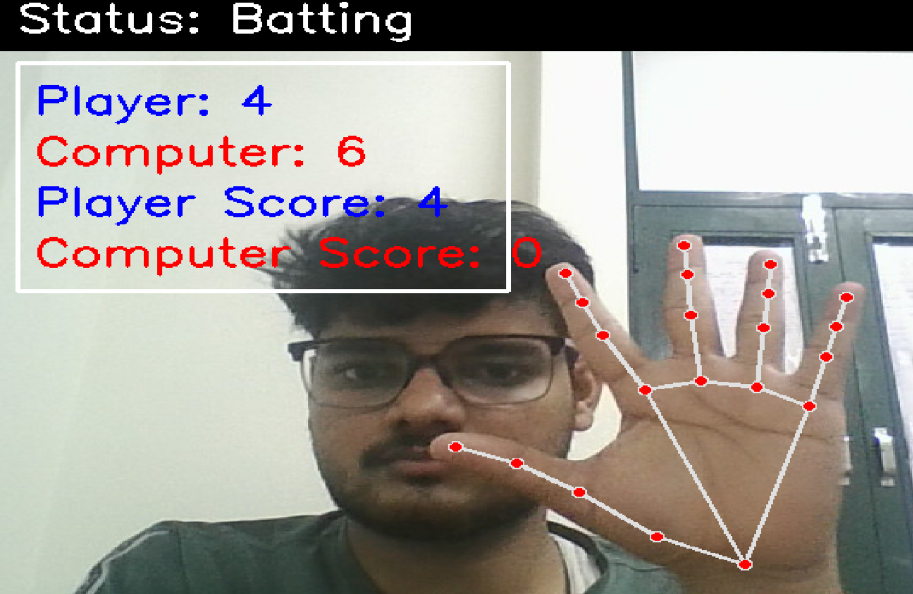
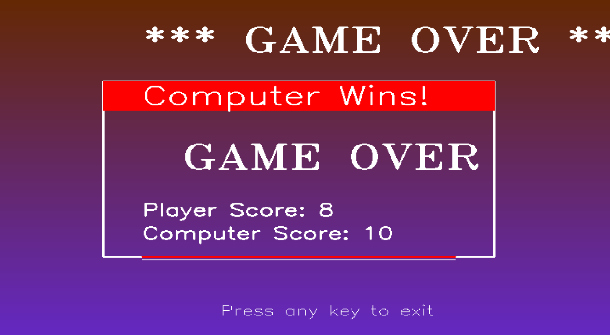

# Hand Cricket Game 🏏

## Description
Hand Cricket is an innovative computer vision-based game that brings the classic cricket experience to your computer! Using your webcam, the game detects hand gestures to play cricket in a fun and interactive way. This project combines computer vision technology with the excitement of cricket, making it accessible and enjoyable for everyone.

## How to Play ✋

1. **Gesture Recognition**: Show numbers 1-6 using your fingers to play
2. **Batting Mode**: Score runs by showing numbers - if your number matches the computer's, you're out!
3. **Bowling Mode**: Try to get the computer out by matching its number
4. **Game Flow**: 
   - First, you bat and try to score as many runs as possible
   - Then, you bowl and try to defend your score
5. **Controls**:
   - 'q' key to quit the game
   - Follow on-screen instructions for gameplay

## Requirements 🛠️
- Python 3.7+
- OpenCV (`pip install opencv-python`)
- Mediapipe (`pip install mediapipe`)
- Webcam

## Installation ⚙️
1. Clone this repository:
   ```bash
   git clone https://github.com/yourusername/hand-cricket.git
   ```
2. Navigate to the project directory:
   ```bash
   cd hand-cricket
   ```
3. Install required packages:
   ```bash
   pip install -r requirements.txt
   ```

## Usage 🚀
1. Run the game:
   ```bash
   python env.py
   ```
2. Follow on-screen instructions
3. Use your hand gestures to play!

## Screenshots 📸

### Game Start Screen



### Game Over Screen


## Game Rules 📜

- Numbers 1-6 are valid gestures
- If your number matches the computer's while batting, you're out
- While bowling, if your number matches the computer's, the computer is out
- The player with the highest score wins!

## Contributing 🤝

Contributions are welcome! Please follow these steps:
1. Fork the repository
2. Create your feature branch (`git checkout -b feature/AmazingFeature`)
3. Commit your changes (`git commit -m 'Add some AmazingFeature'`)
4. Push to the branch (`git push origin feature/AmazingFeature`)
5. Open a Pull Request

## License 📄
This project is licensed under the MIT License - see the [LICENSE](LICENSE) file for details.

## Acknowledgments 🙏
- OpenCV for computer vision capabilities
- Mediapipe for hand gesture recognition
- All contributors who helped make this project possible

Enjoy playing Hand Cricket! 🎉
